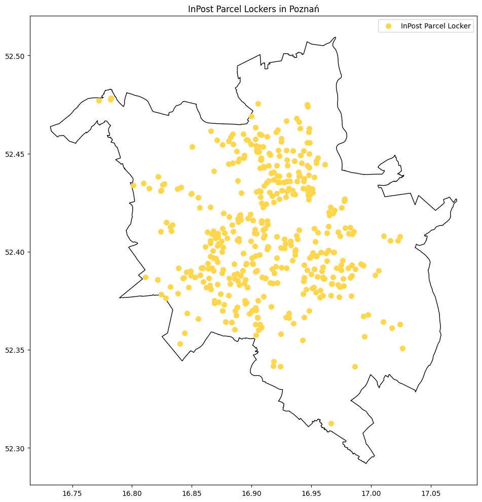

# Spatial Analysis of Amenities Using OpenStreetMap Data  

## Overview  
This project adapts an analysis originally conducted in R, implementing it in Python to examine the spatial distribution of a specific amenity within a city. It utilizes OpenStreetMap (OSM) data to retrieve geographical boundaries, extract relevant locations, and process the data into a geospatial format for further analysis.  

## Key Components  

### 1. Geospatial Data Acquisition  
- The project retrieves administrative boundaries for a selected city using **OSMNx**.  
- A **bounding box** is generated from the city's boundary to define the spatial scope of data extraction.  

### 2. Data Retrieval from OpenStreetMap  
- An **Overpass API query** extracts locations of a specific amenity (e.g., parcel lockers).  
- Data is retrieved in **JSON format** and converted into **GeoJSON** using `osm2geojson` for easier geospatial processing.  

### 3. Data Processing and Filtering  
- The extracted data is converted into a **GeoDataFrame** using `geopandas` to facilitate spatial analysis.  
- **Invalid geometries** are filtered out to ensure data integrity.  

### 4. Visualization and Analysis  
- The processed dataset can be used for **spatial analysis**, such as identifying clusters, density distributions, or accessibility evaluations.  
- Future steps may include refining the dataset with additional filtering, integrating demographic data, or performing **network-based accessibility studies**.  

## Future Improvements  
Currently, the project is designed to work with a specific city. Future enhancements could include:  
- Expanding it to **multiple locations**.  
- Incorporating **additional datasets** (e.g., population density, transportation networks).  
- Obtaining a **detailed shapefile** for administrative subdivisions to provide more granular insights.  

